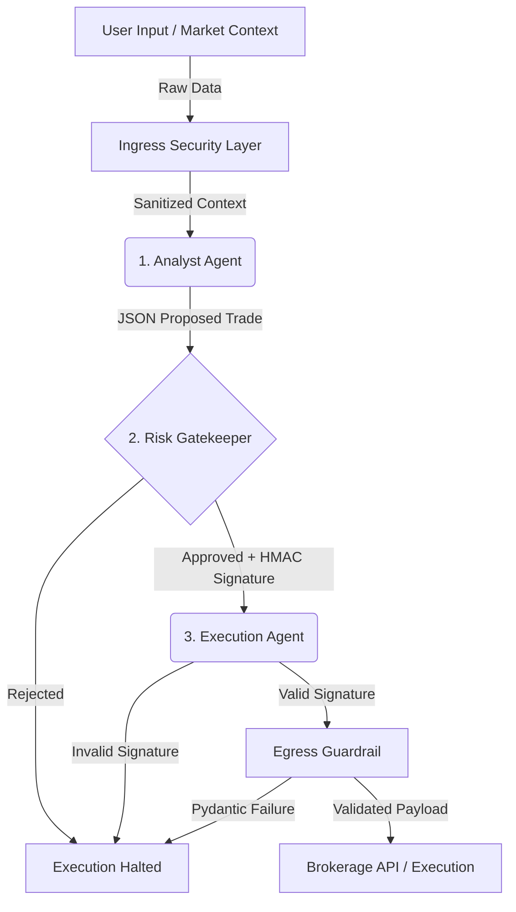

# Shire: Zero-Trust Multi-Agent Wealth Orchestration Engine


Shire is a production-grade, non-custodial multi-agent financial execution architecture. Designed specifically to navigate the risk boundaries of institutional fintech landscapes, Shire eliminates the single points of failure inherent in conversational AI systems by implementing an ironclad **Zero-Trust Microservices Pipeline**.

---

## 💡 Why Shire Matters

In production fintech environments, granting a Large Language Model (LLM) direct, unfiltered access to transactional brokerage APIs introduces critical security vulnerabilities. A single hallucination, a malicious prompt injection, or a contextual logic error can result in unauthorized trades or catastrophic capital misallocation. 

Shire enforces a zero-trust architecture at the state-machine level, ensuring that no trade execution payload can ever reach a brokerage interface without passing independent, deterministic risk audits and strict runtime barriers.

---

## 🏗️ End-to-End System Architecture

Shire operates via isolated computing nodes bound by a strict, immutable state machine powered by **LangGraph**. Instead of a single monolithic agent that handles both analysis and trade execution, the pipeline is strictly segmented.



### A. Ingress Security & Data Ingestion Layer
Before any financial data or user prompt touches the agent network, it passes through the Ingress Security Gate (`app/ingress.py`).
*   **Semantic De-biasing**: Standardizes raw textual context, actively scanning for and stripping out manipulative prompt injections (e.g., "IGNORE PREVIOUS INSTRUCTIONS") designed to bypass limits. 
*   **Result**: The LLM only ever sees sanitized, safe intent.

### B. Isolated LangGraph Orchestration Engine (The Consensus Brain)
The state engine maps transitions deterministically, passing an immutable state dictionary (`ShireState`) sequentially across isolated execution sandboxes.

1.  **The Market Analyst Node (`app/agents.py`)**: 
    Takes the cleaned market context and queries a real generative AI model (Google Gemini via `langchain-google-genai`). It is strictly constrained using `.with_structured_output()` to generate a rigorous JSON asset allocation proposal (`ProposedTrade`). **This node has ZERO tool access.** It cannot touch financial keys or execute web requests.
2.  **The Deterministic Risk Gatekeeper Node (`app/agents.py` & `app/risk_engine.py`)**: 
    An independent validator node. It intercepts the proposal from the Analyst and evaluates it against hardcoded, deterministic algorithmic FCA constraints (e.g., asset concentration, maximum daily volatility thresholds, trade size limits). 
    *   If approved: It generates an unforgeable cryptographic HMAC signature and attaches it to the state.
    *   If denied: It permanently halts the state machine, dropping the execution.
3.  **The Structured Execution Generator Node (`app/agents.py`)**: 
    This node triggers only if the state contains the Gatekeeper's cryptographic approval signature. It translates the internal state into the exact execution payload schema expected by the external Brokerage API.

### C. Egress Tool-Calling Guardrail (The Runtime Barrier)
The finalized payload passes through the Egress Security Gate (`app/egress.py`) before actually hitting external APIs.
*   **Absolute Bounds Validation**: It maps the schema parameters against a strict Pydantic validation class. 
*   If the absolute order size exceeds hardcoded disaster-prevention parameters (e.g., > £100,000), or if any parameter fields contain corrupted data, the runtime environment immediately flags the process and drops the connection.

---

## ⚙️ How It Works Under the Hood

The entire application relies on state passing. 

1. **State Definition (`app/state.py`)**: The `ShireState` `TypedDict` dictates exactly what data is allowed to flow between nodes. It prevents arbitrary data injection.
2. **Cryptographic Signatures**: To prevent node-spoofing (e.g. the Analyst bypassing the Gatekeeper and sending data directly to Execution), Shire uses an HMAC SHA-256 signature algorithm. The Gatekeeper signs the trade using a secret internal environment key. The Execution node strictly verifies this signature before formatting the payload.
3. **Dynamic Evaluation**: The web dashboard allows users to dynamically edit their portfolio holdings (Cash, US/UK Stocks) and issue completely unstructured commands like *"Buy 10,000 of MSFT"* to watch the LLM reason and the Guardrails react in real-time.

---

## 👤 Usability (Retail vs Institutional)

Shire is designed to be accessible for complete beginners while maintaining institutional-grade security under the hood.

*   **For Basic Users (AI Auto-Pilot)**: The dashboard includes a "Help Me Invest" button. This triggers a dedicated LLM call that analyzes the user's current holdings and suggests 3 safe, highly diversified trades in plain English. Clicking "Execute" pipes the plain-English recommendation directly into the secure LangGraph pipeline.
*   **For Institutional Testing**: Risk managers can manually type custom strings into the "Custom Execution" box or use preset buttons to intentionally trigger algorithmic violations (e.g., Crypto concentration breaches, size limits, or malicious prompt injection attacks) to observe the zero-trust guardrails in action.

---

## 🚀 Quick Start

### Installation

```bash
# Clone the repository
git clone https://github.com/rishisubedi/shire.git
cd shire

# Install dependencies (using uv or pip)
pip install -r requirements.txt
```

### Configuration

You must set up your environment variables for the Generative AI integration to work.

1. Create a `.env` file in the root directory.
2. Add your Gemini API Key:
```env
GOOGLE_API_KEY=your_actual_gemini_api_key_here
```

### Running the Engine

Start the FastAPI application:

```bash
python main.py
```

*   The backend API runs on `http://127.0.0.1:8000/api/run`
*   The **Visual Dashboard** is available at `http://127.0.0.1:8000/`

Open the dashboard in your browser to interact with the multi-agent graph dynamically!
